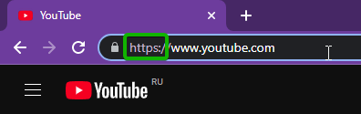
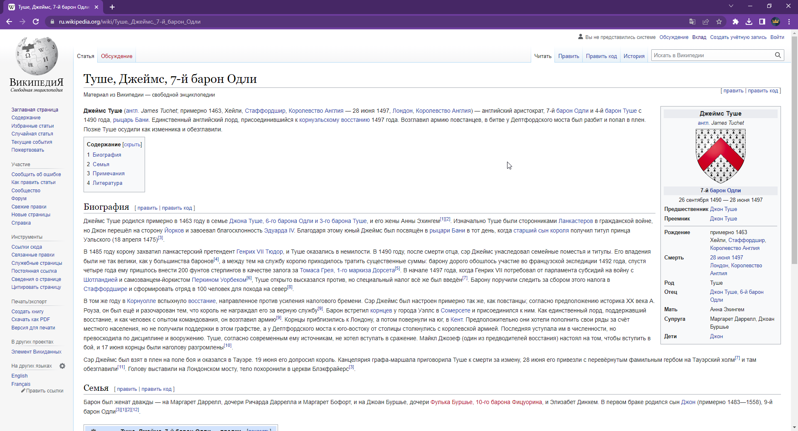
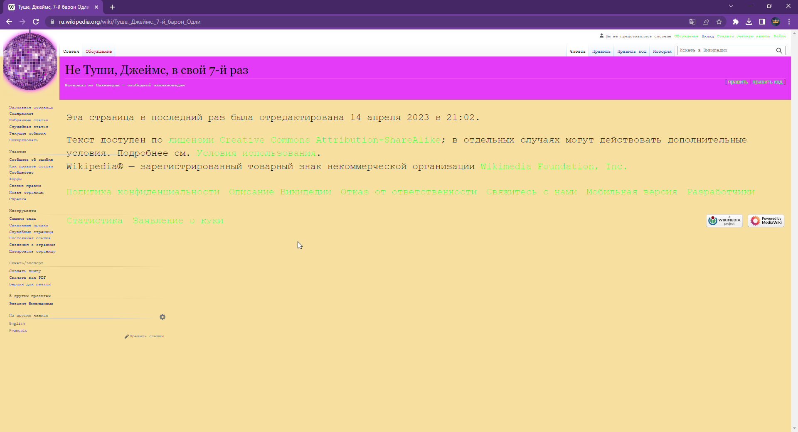
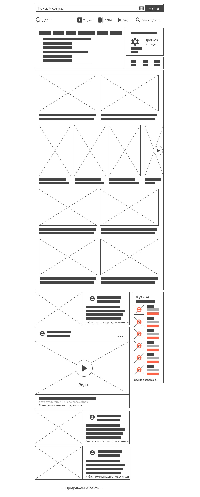

# Homework 1

1. YouTube.com использует протокол **HTTPS**



2. Содержимое файла `2_analyze.txt`
```
Нужен сайт для публикации статей и других материалов.

    1) Шапка сайта будет содержать ссылки для регистрации/авторизации пользователей

    2) Логотип сайта будет размещен в левой колонке и ниже будет располагаться навигация:
    - Заглавная страница
    - Содержание
    - Избранные статьи
    - Случайная статья
    - Текущие события
    - Пожертвовать
    Далее по рубрикам:
    - Участие
    - Инструменты
    - Печать/экспорт
    - В других проектах
    - На других языках (с возможностью настройки языка)

    3) Основная часть будет содержать вкладки для просмотра обсуждений и чтения материалов

Тут нужно поприветствовать пользователя, а так же предложить ему 
стать автором и написать свою статью отдельным блоком.

Ниже вывести заголовки и краткое содержание статей, новостей, 
материалов с кнопкой для перехода. В зависимости от размера экрана пользователя – 
компоненты могут быть выведены в несколько колонок. 8-10 записей.

После вывода нужного числа записей – разместить блок со списком 
и ссылками на проекты-партнеров

    4) Подвал сайта должен содержать информацию о копирайте и лицензии. 
Содержать ссылки на политику конфиденциальности, опсание, форму обратной связи 
и другие справочно-информационные ресурсы
```

3. **До** и **После** 

[Туше, Джеймс, 7-й барон Одли](https://ru.wikipedia.org/wiki/%D0%A2%D1%83%D1%88%D0%B5,_%D0%94%D0%B6%D0%B5%D0%B9%D0%BC%D1%81,_7-%D0%B9_%D0%B1%D0%B0%D1%80%D0%BE%D0%BD_%D0%9E%D0%B4%D0%BB%D0%B8)

Страница до изменений:



Внесено 10 корректировок (после):

- Изменен логотип
- Добавлен атрибут `background-size: cover`
- Поменял заголовок
- Информация нам больше не нужна, освобождаем данспол
- Меняем цвет фона
- Меняем цвет области заголовка
- Удаляем рамку вокруг
- Делаем шрифт больше
- Меняем цвет ссылок
- Меняем начертание шрифта на `monospace`

Результат:



4. Составить **Прототип низкой детализации** для https://dzen.ru/  

Прототип низкой детализации нужен для общения с заказчиком, дизайнером или любым другим разработчиком. Тут важно показать какие элементы и как они будут расположены.

> Сервис, где можно сделать `прототип низкой детализации`: https://wireframe.cc/



